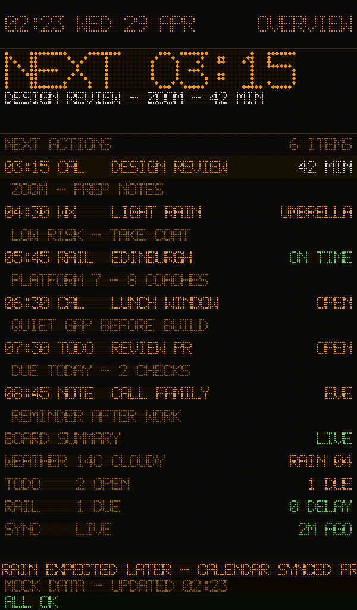
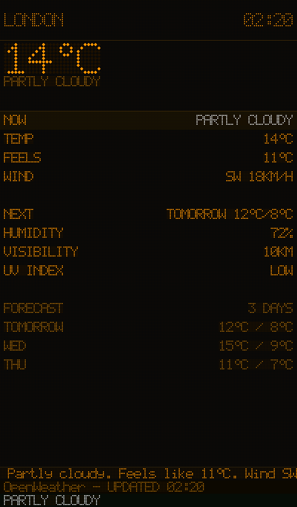

# CC-UK-TR / PiBoard

PiBoard 是一个运行在 Raspberry Pi Zero 2W 上的个人信息显示系统，用 pygame/SDL2 直接渲染英国火车站 LED 点阵风格大屏。当前公开版本标记是 `v0.1-demo-public`：不是继续扩功能，而是能稳定展示、能说明部署方式、能给出 Pi 验收证据。





## 当前 MVP

- 英国火车站风格点阵显示：概览、列车、天气、日程、自定义页面。
- 低功耗演示配置：`single` 布局、`mock` 数据源、`cycle` 预设轮换，动画关闭。
- Web 控制台：中文优先，运行端口 `8080`，常用检查端点为 `/api/state` 和 `/api/device-status`。
- 天气：无 OpenWeatherMap API Key 时默认走 Open-Meteo；有 Key 时保留 OpenWeatherMap 路径。
- 亮度：`device_settings.brightness` 范围为 `0.1-1.0`，由 host-level dimming overlay 应用，默认 `1.0`。
- 私有运行态：`piboard/data/state.json` 不提交；公开示例是 `piboard/data/state.example.json`。

## 本地运行

```bash
cd piboard
pip install -r requirements.txt
python3 main.py --window
```

打开 `http://localhost:8080` 查看 Web 控制台。

## Pi 部署与验收

当前 Pi demo service 使用 direct `kmsdrm`：

```ini
ExecStart=/usr/bin/python3 /home/<pi-user>/CC-UK-TR/piboard/main.py --portrait --display-rotate 90
Environment=SDL_VIDEODRIVER=kmsdrm
Environment=SDL_AUDIODRIVER=dummy
```

部署助手在 `piboard/deployment/sync-to-pi.sh`。验收记录在 [docs/v0.1-demo.md](docs/v0.1-demo.md)，证据截图在 [piboard/review_artifacts/pi-acceptance-v0.1-demo](piboard/review_artifacts/pi-acceptance-v0.1-demo)。

验收覆盖：

- `/api/state` 配置回读
- `piboard.service` active/enabled 状态
- CPU、温度、throttling 采样
- Overview、Train、Weather、Calendar、Custom 页面切换
- 低功耗 cycle 截图序列

## 安全说明

不要提交 `piboard/data/state.json`、私有 iCal URL、个人日历链接、API token、真实密钥或本机诊断截图。需要配置时从 `piboard/data/state.example.json` 复制到本地运行态。

## 本周最小 TODO

- 用公开测试数据复核 Huxley2 或 Transport API 列车实况路径。

更多实现细节见 [piboard/README.md](piboard/README.md)。
